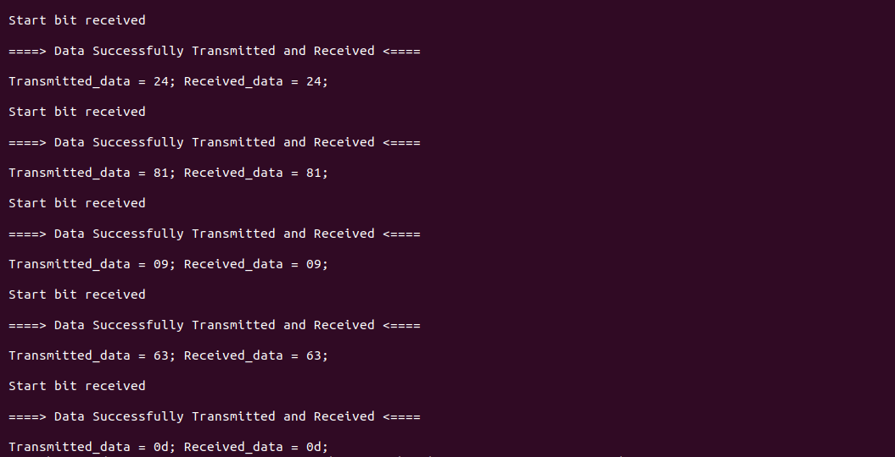

# UART_Transmitter_Receiver

## Overview
  This repository contains an implementation of Uart Transmitter and Receiver.

## Languages Used
  * System Verilog
  * C++
  * Makefile 


## Environments Used

  * Linux Ubuntu 22.04.2

# System Design Overview

  Representation of architecture through clear block diagrams is shown below.
## Block Diagram
The block diagram of the Uart Transmitter and Receiver is given below.


## TX_Datapath

 

## TX_Controller 

 

## RX_Datapath

 

## RX_Controller 

 


# Getting Started

## 1. Clone the Repository
       
To use the UART Transmitter and Receiver implementation, clone this project using HTTPS:

 ```markdown
 git clone https://github.com/Zawaher-Bin-Asim/UART_Transmitter_Receiver.git
```

## 2. Installation of Vivado and Verilator 

Install [Vivado](https://github.com/ALI11-2000/Vivado-Installation) and [Verilator](https://verilator.org/guide/latest/install.html). Follow the instructions provided in the corresponding links to build these tools.

## Build Model and Run Simulation

To build Uart Transmitter and Receiver, use the provided Makefile. Follow the steps below for simulation using Verilator or Vivado.

### Simulation with Verilator
Run the following command to simulate using Verilator:

```markdown
  make verilator
```


To view the waveform generated by Verilator, execute:

```markdown
make ver_waves
 ```
### Simulation with Vivado
For simulation on vivado run the following command:

```markdown
make 
```

The waves on vivado will be created that can be viewed by running

```markdown
make viv_waves
``` 

# Successful Implementation

## Implementation with Verilator

Upon successful execution of the `make verilator` command, the terminal log output for Uart Transmitter and Receiver, is presented below:

 

### Implementation with Vivado

Running the `make vivado` command generates the terminal log output as shown below:

 

# Waveform Drawn

The waveform is shown below:
## Vivado
 

## GTKWAVE
 

 


